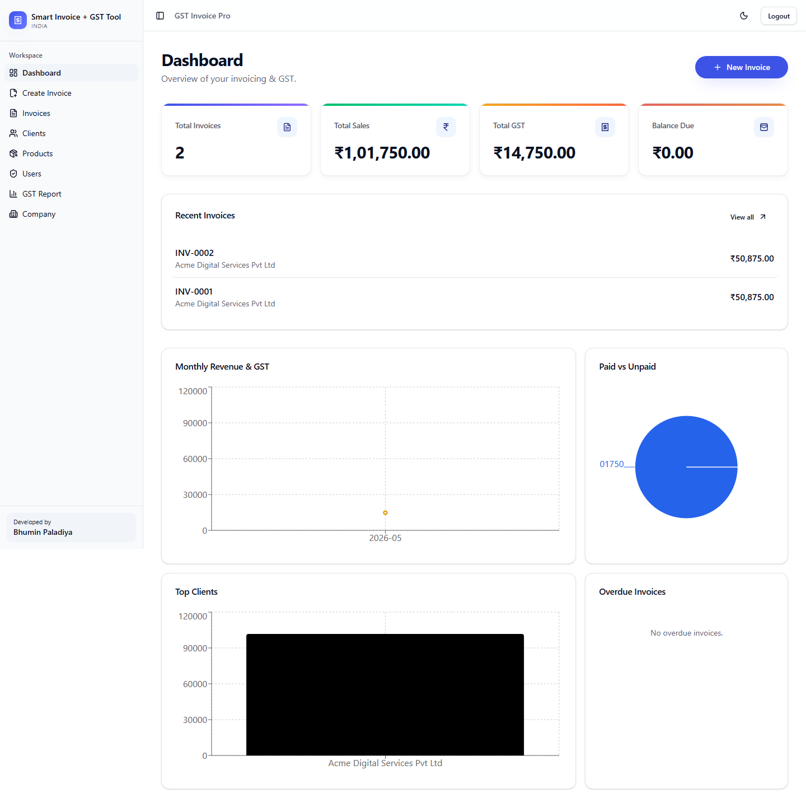
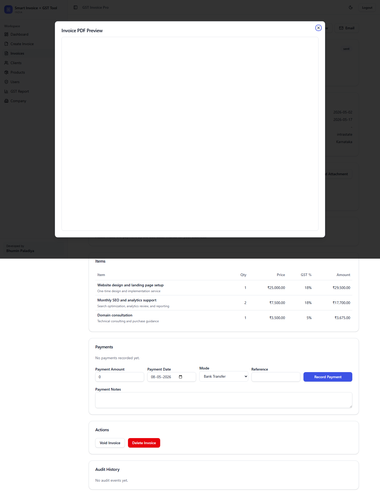
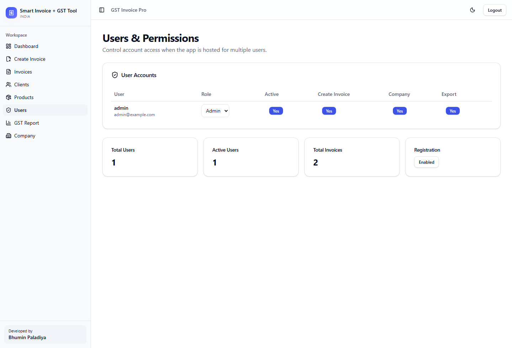
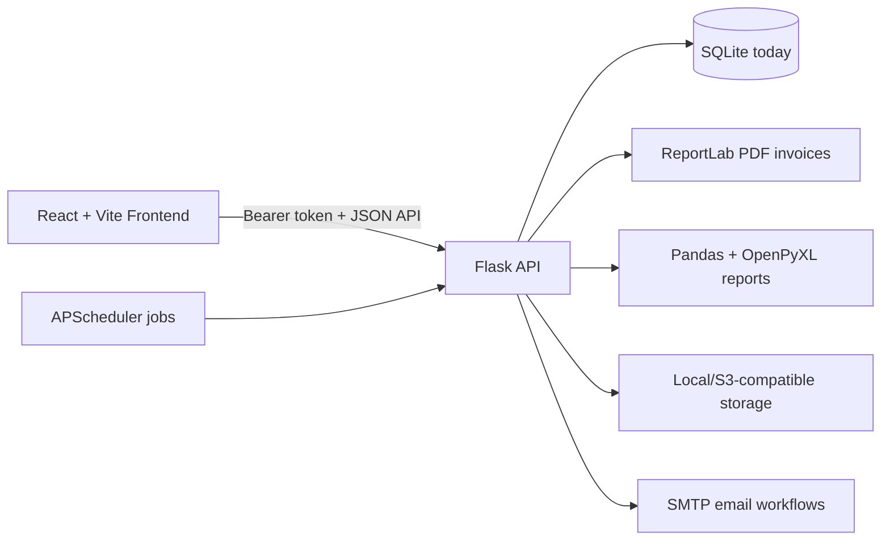

# Smart Invoice + GST Tool India

Production-ready full-stack invoicing and GST management app for Indian freelancers, agencies, and small businesses.



## Highlights

- Multi-user account system with admin-controlled permissions
- Per-user company profile, logo, authorized signature, invoice prefix, and numbering
- GST invoice creation with intrastate CGST/SGST and interstate IGST support
- Professional Zoho-style PDF invoices
- PDF preview before download
- Payment recording with receipt PDF generation
- Client master and product/service master
- Invoice workflow: draft, sent, paid, partially paid, overdue, void
- Search and filters by invoice number, client, status, and dates
- GST Excel reports with CGST, SGST, IGST, and summary sheets
- Email invoice PDF through SMTP
- Full backup, restore, Excel export, and JSON export
- Invoice audit history for create, edit, payment, void, clone, and delete activity
- Dashboard charts for revenue, GST, paid/unpaid status, top clients, and overdue invoices
- CSV/Excel import for client and product/service masters
- Recurring invoice UI with client/product selection and due-run generation
- Payment reminder settings, custom reminder templates, scheduler hook, and reminder history
- Secure public client portal links for invoice view/download and payment-proof upload
- Client portal link expiry/revoke, client messages, payment timeline, and proof review
- Invoice attachments for work proof, PO documents, payment receipts, and supporting files
- Admin overview with registration toggle, activity, login security events, job logs, portal links, uploads, user totals, and storage usage
- OpenAPI JSON and API docs at `/api/docs`
- Automated backend regression tests with pytest
- Playwright frontend E2E tests for login/register, invoice creation, invoice detail actions, and client portal
- YAML-based configuration
- Docker setup for local deployment
- SQLite today, with SQLAlchemy migration scaffold for PostgreSQL/MySQL
- Demo data seeding for portfolio screenshots and local testing
- Estimate/quotation and expense tracking APIs

## Example Screens

### Invoice PDF



### Users and Permissions



Screenshots can be regenerated after starting backend and frontend:

```powershell
cd frontend/gst-gem-main
npm install
cd ../..
node docs/capture-screenshots.mjs
```

## Tech Stack

### Backend

- Python 3.10+
- Flask
- SQLite
- Pandas
- ReportLab
- OpenPyXL
- PyYAML
- SQLAlchemy scaffold for future PostgreSQL/MySQL migration

### Frontend

- React
- TanStack Router
- TanStack Query
- Vite
- Tailwind-style component system
- Lucide icons

## Architecture



PostgreSQL is tracked as the next major backend migration. The config and SQLAlchemy adapter scaffold already exist, but the active repository layer still uses `sqlite3`.

## Project Structure

```text
smart-invoice/
|-- backend/
|   |-- app.py
|   |-- config.yaml
|   |-- config.production.yaml
|   |-- database/
|   |-- models/
|   |-- routes/
|   |-- services/
|   |-- tests/
|   |-- utils/
|   |-- outputs/
|   `-- requirements.txt
|-- frontend/
|   `-- gst-gem-main/
|       |-- src/
|       |-- package.json
|       `-- vite.config.ts
|-- docs/
|   |-- DEPLOYMENT.md
|   `-- images/
|-- .github/workflows/ci.yml
|-- docker-compose.yml
|-- LICENSE
`-- README.md
```

## Quick Start

### Backend

```powershell
cd backend
pip install -r requirements.txt
python app.py
```

Backend runs at:

```text
http://localhost:5000
```

Health check:

```text
http://localhost:5000/api/health
```

### Frontend

```powershell
cd frontend/gst-gem-main
npm install
npm run dev
```

Frontend uses:

```text
VITE_API_BASE=http://localhost:5000/api
```

Set this in `frontend/gst-gem-main/.env` for another backend URL.

## Default Login

```text
username: admin
password: admin123
```

## Seed Demo Data

For a polished local demo with company settings, clients, products, invoices, an estimate, expenses, a recurring profile, and generated invoice PDFs:

```powershell
python backend/scripts/seed_demo.py --reset
```

Then start the backend and frontend normally.

Change this before deployment:

```yaml
auth:
  admin_username: admin
  admin_password: change-this-password
  admin_email: admin@example.com
```

## Multi-User Behavior

- Normal users see only their own invoices, clients, products, dashboard, GST reports, and company settings.
- Admins can see all users' invoices, clients, and products.
- Admins can manage user roles and permissions from the Users page.
- Each user has a separate company profile, logo, signature, invoice prefix, and numbering series.
- User A and User B can both have `INV-0001` because invoice numbering is scoped per user.

## Permissions

Admins can control:

- User active/inactive state
- Role: `admin` or `user`
- Create invoice permission
- Manage company permission
- Export data permission

## Configuration

Runtime settings are centralized in:

```text
backend/config.yaml
backend/config.py
backend/.env.example
```

Important environment overrides:

```text
APP_HOST=0.0.0.0
APP_PORT=5000
APP_DEBUG=false
SECRET_KEY=change-this-secret-key
AUTH_ENABLED=true
ADMIN_USERNAME=admin
ADMIN_PASSWORD=change-this-password
DATABASE_ENGINE=sqlite
SQLITE_DATABASE_PATH=database/db.sqlite3
```

## Email Setup

Email is disabled by default. To enable invoice email sending:

```yaml
email:
  enabled: true
  smtp_host: smtp.gmail.com
  smtp_port: 587
  use_tls: true
  username: your@email.com
  password: your-app-password
  from_email: your@email.com
  from_name: Smart Invoice
```

For Gmail, use an app password.

## Docker

```powershell
docker compose up --build
```

Services:

```text
Backend:  http://localhost:5000
Frontend: http://localhost:3000
```

Before production use, change:

```text
ADMIN_PASSWORD
SECRET_KEY
cors.origins
email settings
```

## API Overview

```text
POST            /api/auth/login
GET             /api/auth/me
POST            /api/auth/register
POST            /api/auth/forgot-password
POST            /api/auth/reset-password
POST            /api/auth/verify-email
POST            /api/auth/change-password

GET             /api/users
PUT             /api/users/<id>
GET             /api/users/admin/overview
PUT             /api/users/admin/settings

GET/POST        /api/invoices
GET/PUT/DELETE  /api/invoices/<id>
GET             /api/invoices/<id>/audit
GET             /api/invoices/next-number
GET             /api/invoices/<id>/pdf
POST            /api/invoices/<id>/email
POST            /api/invoices/<id>/void
POST            /api/invoices/<id>/clone
POST            /api/invoices/<id>/payments
GET             /api/invoices/<id>/payments/<payment_id>/receipt

GET/POST        /api/estimates
GET/PUT/DELETE  /api/estimates/<id>
POST            /api/estimates/<id>/convert

GET/POST        /api/expenses
GET/PUT/DELETE  /api/expenses/<id>

GET/POST        /api/clients
POST            /api/clients/import
GET/PUT/DELETE  /api/clients/<id>

GET/POST        /api/products
POST            /api/products/import
GET/PUT/DELETE  /api/products/<id>

GET/POST        /api/recurring-invoices
PUT/DELETE      /api/recurring-invoices/<id>
POST            /api/recurring-invoices/run-due

GET             /api/reminders/payments
POST            /api/reminders/payments/send
GET/PUT         /api/reminders/settings
POST            /api/reminders/run-auto
GET             /api/jobs
POST            /api/jobs/run

POST            /api/invoices/<id>/public-link
DELETE          /api/invoices/<id>/public-link
POST            /api/invoices/<id>/attachments
POST            /api/invoices/<id>/payment-proof/review
GET             /api/portal/<token>
GET             /api/portal/<token>/pdf
POST            /api/portal/<token>/payment-proof
POST            /api/portal/<token>/message

GET/POST        /api/company
POST            /api/company/logo
POST            /api/company/signature

GET             /api/dashboard/summary
GET             /api/dashboard/analytics
GET             /api/reports/gst?month=5&year=2026
GET             /api/backups/export
POST            /api/backups/restore
GET             /api/exports/data?format=xlsx
GET             /api/exports/data?format=json
GET             /api/config/public
GET             /api/docs
GET             /api/docs/openapi.json
GET             /api/health
```

## Database

Current active adapter:

```text
SQLite
```

The app includes configuration profiles and dependencies for:

- SQLite
- PostgreSQL
- MySQL
- MongoDB

SQLite is the current working adapter because the model layer uses Python `sqlite3`. PostgreSQL/MySQL configuration is ready, but the repository layer still needs to be moved to SQLAlchemy before those engines can be activated safely:

```text
backend/database/sqlalchemy_adapter.py
backend/database/MIGRATION.md
```

## Data Export and Backup

Available from the Reports page:

- GST Excel report
- Full Excel export
- Full JSON export
- Full backup zip
- Backup restore

Runtime outputs are intentionally ignored from Git:

```text
backend/database/db.sqlite3
backend/outputs/
```

## Verification Checklist

Automated backend tests:

```powershell
python -m pytest backend/tests
```

Frontend production build:

```powershell
cd frontend/gst-gem-main
npm run build
```

Frontend E2E tests:

```powershell
cd frontend/gst-gem-main
npx playwright install chromium
npm run test:e2e
```

- Login as admin
- Create a new user
- Confirm admin can change permissions
- Login as the new user
- Set company profile and invoice prefix
- Create invoice with GST
- Preview invoice PDF
- Download invoice PDF
- Record payment
- Download receipt PDF
- Generate GST report
- Export Excel/JSON data
- Download backup zip

## Production Notes

- Use a strong `SECRET_KEY`
- Change admin password immediately
- Disable open registration if public access is not intended
- Configure exact CORS origins
- Use HTTPS in production
- Enable scheduler jobs with `SCHEDULER_ENABLED=true` only after SMTP and company/client email data are configured
- Configure `MAX_UPLOAD_MB`, login lockout, and rate limit settings for your deployment
- Prefer PostgreSQL for hosted multi-user deployment after migrating the repository layer from `sqlite3` to SQLAlchemy
- Do not commit SQLite database, generated PDFs, uploaded logos, or backup zips
- Revoke and rotate any GitHub or SMTP token that was accidentally printed or shared

## Developer Signature

Developed by [Bhumin Paladiya](https://www.linkedin.com/in/bhumin-paladiya).
